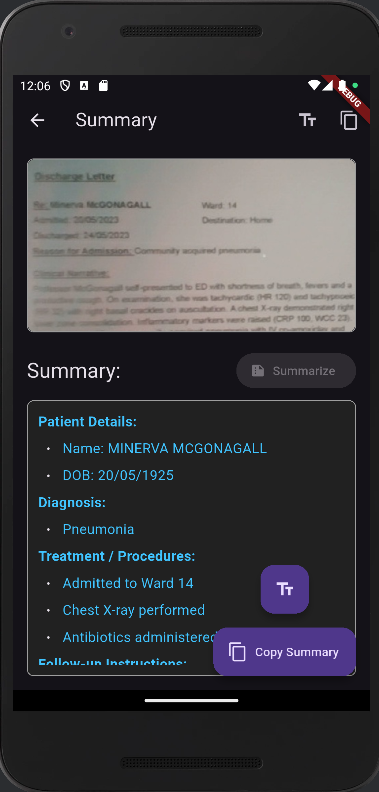

# Docsum

This is a Flutter mobile app that:
1. Uses the device **camera** to capture images of hospital discharge letters.
2. Runs **OCR (Optical Character Recognition)** with [Google ML Kit](https://pub.dev/packages/google_mlkit_text_recognition) to extract text from the image.
3. Sends the extracted text to a **FastAPI backend** that calls the **Gemini API** to generate a clean structured summary:
   - Patient Details
   - Diagnosis
   - Treatment / Procedures
   - Follow-up Instructions

---

## Features
- 📷 Take a picture with your phone camera.
- 📝 Extract text directly from the image.
- ✂️ Summarize the hospital discharge letter into meaningful sections.
- 📋 Copy extracted or summarized text to clipboard.

---

# Under development, a downloadable apk will be released soon!
